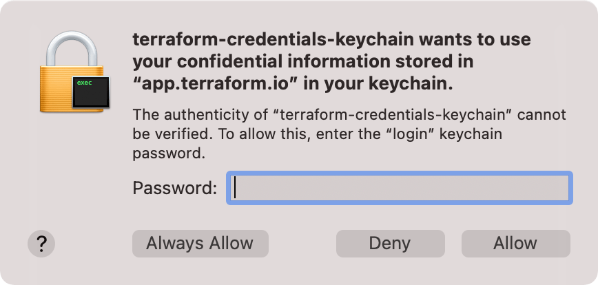

# terraform-credentials-keychain [](https://github.com/bendrucker/terraform-credentials-keychain/actions?query=workflow%3Atests)

> A Terraform [credentials helper](https://www.terraform.io/docs/commands/cli-config.html#credentials-helpers) that stores your credentials in the system keychain

By default, `terraform login` writes your Terraform Cloud credentials (i.e. API token) as a plain text file in your home directory. Any program you run can read this file, potentially stealing your credentials. 

With this credential helper installed, your credentials will instead be stored in the system keychain. This helper uses [99designs/keyring](https://github.com/99designs/keyring) and can use any credential storage backend it supports. Currently, only macOS is actively tested.

## Installing

Download an appropriate [release binary](https://github.com/bendrucker/terraform-credentials-keychain/releases) for your operating system/architecture. [Install it](https://www.terraform.io/docs/plugins/basics.html#installing-plugins) into the appropriate Terraform plugin directory. Credentials helpers are stored in the same directory as provider plugins.

For example, on macOS, you should install the binary as:

```
~/.terraform.d/plugins/darwin_amd64/terraform-credentials-keychain
```

Releases for macOS are [signed and notarized](https://developer.apple.com/developer-id/) so that the system will trust the application.

## Usage

Run `terraform logout` for each Terraform host you connect to. For Terraform Cloud, you can run `terraform logout` directly. For Terraform Enterprise, supply the hostname of the Terraform Enterprise server. This will remove all plain text credentials stored in the `credentials.tfrc.json` or print an error if credential blocks are defined in `.terraformrc`. These credentials will bypass the credential helper if they are not removed. You should also revoke these API tokens from your Terraform Cloud user settings.

Add the credential helper to `~/.terraformrc` file:

```
credentials_helper "keychain" {}
```

Now when you use `terraform login` and `terraform logout`, they will use your system keychain rather than persisting credentials directly to disk!

[](https://asciinema.org/a/334212)

Each time you run a `terraform` command that uses your credentials (e.g. `init`, `plan`, `apply`, etc.), the credential helper will read your credentials from the keychain, prompting for a password if needed.

## Security

Any command that requires Terraform Cloud credentials, including most `terraform` commands, will prompt for the keychain password:



For maximum security, click _Allow_ and enter your password every time it is required by Terraform or another program. If you run Terraform frequently, this may become tedious. If you click _Always Allow_, you will never be prompted for a password again. Your credentials will still be protected from a malicious program scanning your disk, but a program that calls `terraform-credentials-keychain get <host>` will still be able to obtain them. 

If you choose this option, consider [configuring your keychain to lock after a period of inactivity](https://support.apple.com/guide/keychain-access/mac-keychain-password-kyca1242/mac). You can also use a dedicated keychain, instead of the default _login_ keychain:

```hcl
credentials_helper "keychain" {
  args = ["--keychain=terraform"]
}
```

After adding your credentials, you can open Keychain Access to edit the keychain's auto-lock settings:

```sh
open ~/Library/Keychains/terraform.keychain-db
```
